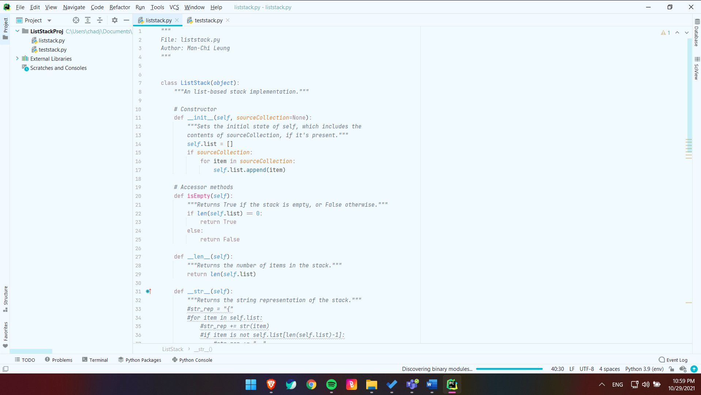

In my Computing Fundamentals II course, I created a ListBag object class for use in future projects.

I remember last semester I really disliked these sort of projects because I didn't quite understand how methods for different types of collection objects worked. But as I've done more and more of them, I've found them getting easier and easier. This one barely gave me any difficulty at all.

I suppose the lesson here is that repetition, while boring, is an extremely effective teaching tool and even a necessity when learning new concepts.

